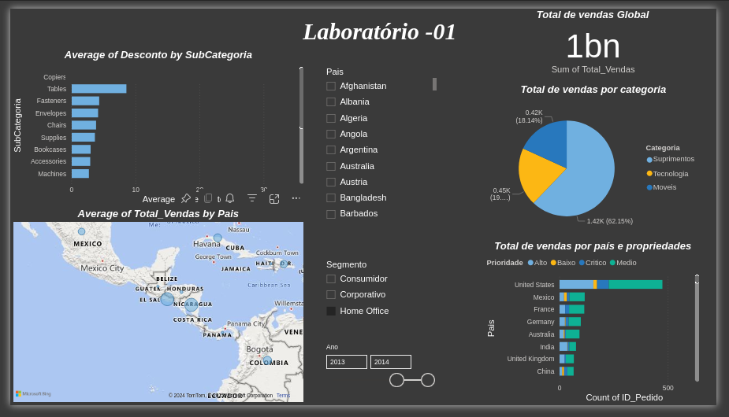

% New Note
% Tuesday, 14/01 10∶29
% Notebook: No Notebook

# Power BI Data Analysis Project: Global Sales Insights

## 🎯 Project Objectives
- Analyze global sales performance and highlight total revenue.
- Explore sales distribution by category (Supplies, Technology, Furniture).
- Examine the impact of discounts on different subcategories.
- Identify high-performing regions using geographical sales data.
- Segment customers into Consumer, Corporate, and Home Office to analyze their behavior.

## 📊 Tools Used
- Power BI
- Simulated sales data

## 🔍 Key Insights
- Total sales across all regions reached **1 billion units**.
- Supplies lead with 62% of total sales.
- Countries like the **United States, Mexico, and France** are top performers.

## 🖼️ Dashboard Preview

## 📂 Files Included
- `dashboard.pbix`: Power BI project file (if applicable).
- `data/sales-data.csv`: Dataset used for analysis.

## 📈 Key Visualizations
1. Average Discount by Subcategory
2. Sales by Category (Pie Chart)
3. Total Sales by Country and Priority (Bar Chart)

## 🚀 Future Improvements
- Add seasonal trends and predictions.
- Explore customer behavior in depth.
